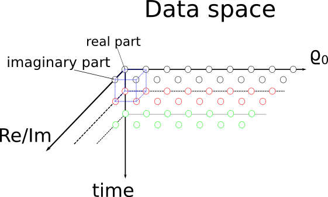

Design Overview
===============

The aim of this project is to implement a framework for the multi dimensional
inversion of multi-frequency complex resistivity data. However, the core
interface was implemented to accomodate arbitrary data and model parameters.
This should allow the use of this framework for other purposes, e.g. the
imaging of single frequency complex resistivity data.

The use of arbitrary dimensions allows the implementation of e.g.
time-regularization or even space-time regularization. In addition, multiple
regularization functions be registered for each dimension.

The inversion is implemented as a real valued inversion which collapses all
dimensions prior to the inversion step. However, regularization matrices are
formulated for the one-dimensional problem (e.g. frequency regularization), and
than propagated to dimensions (see :doc:`inversion`).

.. blockdiag::

    NDimInv {
        NDimInv -> ND_Model, ND_Data;
        ND_Model -> Model_Object;
        NDimInv -> iteartion_list -> Iteration <- Inversion
    }

Each multi dimensional inversion is implemented in a *NDimInv* (see
:doc:`api/NDimInv`) object. The *NDimInv* object contains references to
one *ND_Data* object (which stores the input data) and an *ND_Model* object
(which handles most of the model specific information). The *ND_Model* class is
constructed in a generic way, and the actual forward function, including its
Jacobian, is accessed only through an model object.

*NDimInv* also holds a list of iterations and functions to perform the
inversions. The inversion logic (i.e. the model update) is implemented in the
*Iteration* class. This allows for much flexibility in the inversion as each
iteration can be used for further iterations. This is especially handy for
debugging purposes and testing of new functionality.

The aim of the *NDimInv* class is to provide a flexible inversion framework for
the implementation of specific inversion problems. As such it is not meant to
be used directly to fit data to a model. Here a specific user interface should
be implemented (i.e. the debye_decomposition routine:
:doc:`programs/dd_single`). However, another aim of the *NDimInv* class is to
allow for a relatively easy use with the IPython Notebook (e.g. for the
in-depth analysis of certain fitting problems)

A typical inversion consists of the following steps:

* Gather data and gather model specific settings (e.g. frequencies or number of
  relaxation times)
* Create a *NDimInv* object and provide model specific settings
* Define extra dimensions (see :ref:`ref_data_and_model_dims`)
* Register data with the inversion object
* Set the type of steplength selection
* Set one or multiple regularization functions
* Set custom plot routines for each iteration
* Start the inversion
* Analyse the inversion

A user interface should thus implement those steps and provide the means to
change certain settings adapted to the specific problem. Also a clearly defined
command line interface should be provided (again, see for example
:doc:`programs/dd_single`)

.. _ref_data_and_model_dims:

Data and Model dimensions
-------------------------

In general minimal dimensions can be defined for the data space and the model
space. These minimal dimensions (from here on: base dimensions) are defined by
the input and output values of the forward model. If we deal with complex
resistivity spectra, the base dimensions of the data space are (frequencies,
complex_resistivity). Thus we have two base dimensions in this case. The base
model dimensions depend on the model we try to fit. For a Cole-Cole model this
model space is one dimensional and contains four parameters: :math:`\rho_0, m,
\tau, c`. Depending on the model there could also be more dimensions, but
usually we deal only with one model dimension.

In addition to the base dimensions, which are different for the data and the
model space, there can be so called extra dimensions. Those extra dimensions
replicate the base dimensions and are not covered by the forward model.
Examples for extra dimensions are time and space, given that the model does not
include those dimensions. Extra dimensions do not change for data and model
space, and the only interaction between those dimensions can be by way of
regularization.

Choice of regularization parameters
-----------------------------------

The choice of regularization parameters is already tricky for one-dimensional
problems, but it becomes much harder one muliple dimensions and multiple
regularization parameters are involved (even for the same dimension). In
addition, the question arises if a sequential optimization of first reg.
paramters and then step lengths results in an optimal model update, or if the
steplength should be optimized for each tested lambda.

The following procedures are proposed:

* Implement a dumb, sequential lambda optimization: the whole problem is
  treated as a one-dimensional problem and we test various lambda values for an
  optimal RMS value (most of the time we optimize only for imaginary
  part/phase, but this will be used-changeable). Afterwards an additional step
  to find an optimal steplength (larger than zero, smaller or equal to one) is
  applied.

* Each registered regularization funtion has its own object to determine an
  optimal lambda (dependent on the last iteration). Those objects are queried
  in the order of dimensions (and in order of registration within those
  dimensions). For now no information about other regularization parameters
  will be provided to those objects. Thus each lambda function only has the
  last iteration to decide upon the next optimal lambda value

The following extensions should be evaluated:

* Implement one lambda for each spectrum (as in the Karaoulis papers, TODO:
  References)

* Make the lambda object aware of already chosen lambdas. This will have the
  implication that the query order will matter.

* it could be interesting to simultaneously determine two or more lambda
  values, at least all lambda values for one dimension

Rejection of spectra
--------------------

For most spectroscopic applications it is still feasable to decide on a
per-spectrum basis to fit oder not to fit. However, when dealing with imaging
data and/or time-lapse data, the number of spectra increases dramatically, and
the need for a robust, (semi-)automatic mechnism for the rejection of spectra
arises. This includes the possibility to proceed with an inversion of a whole
set of spectra in the case of one spectrum becoming unfittable. Another
important aspect is which model parameters to use as surrogates (spectra cannot
easility be removed from a data set once multiple dimensional data is used).

The following procedure is proposed:

* before the inversion, spectra are tagged as being rejected using a binary
  mask

* the model parameters for those spectra will be fixed to the starting
  values, this will be accomplished by setting the model update in each
  iteration to zero for tagged spectra.

In the near future we plan to also implement the following feature(s):

* in the case a tagged model parameter is used in one of the regularization
  matrices (i.e. has a non-zero value), this entry will be set to zero,
  effectively canceling the regularization.

* we could think of skipping those spectra in those cases and increase the
  regularization to the next spectrum in the specific dimension. Howoever, this
  requires some detailed planning ;-)
