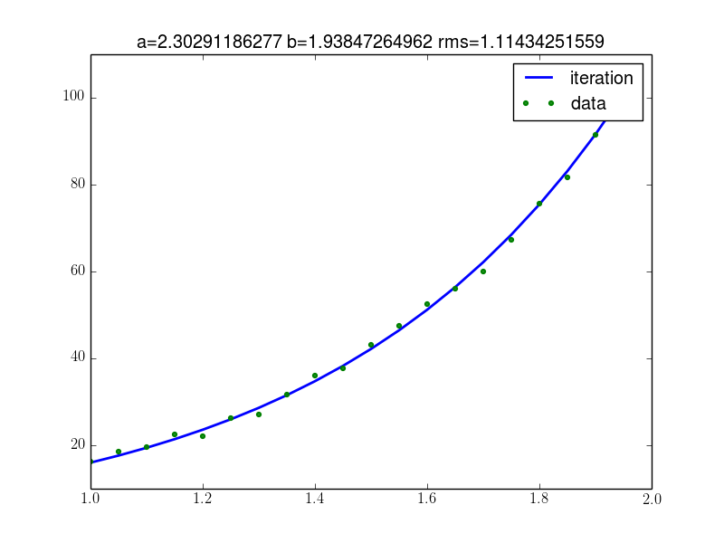

Build you own inversion
-----------------------

This tutorial describes setting up an inversion using the *exp_fit* example.
Suppose you want to fit a given set of data points (x,y) to the function
:math:`f(x) = a \cdot e^{b \cdot x}`:

.. plot::

    from NDimInv.plot_helper import *
    import numpy as np

    # generate data to be fitted
    x = np.arange(1, 2, 0.05)
    y = 2.0 * np.exp(x * 2.0)
    np.random.seed(5)
    y += np.random.uniform(0, 5, x.size)

    fig, ax = plt.subplots(1, 1)
    ax.plot(x, y, '.-', label='data')
    ax.legend()
    ax.set_xlabel('x')
    ax.set_ylabel('y')

The first thing to do is to set up the forward model to fit to the data:

.. literalinclude:: ../../examples/exp_fit/model.py
    :language: python
    :linenos:

The inversion is then constructed using the NDimInv module:

.. literalinclude:: ../../examples/exp_fit/fit.py
    :language: python
    :linenos:

Providing the result:

